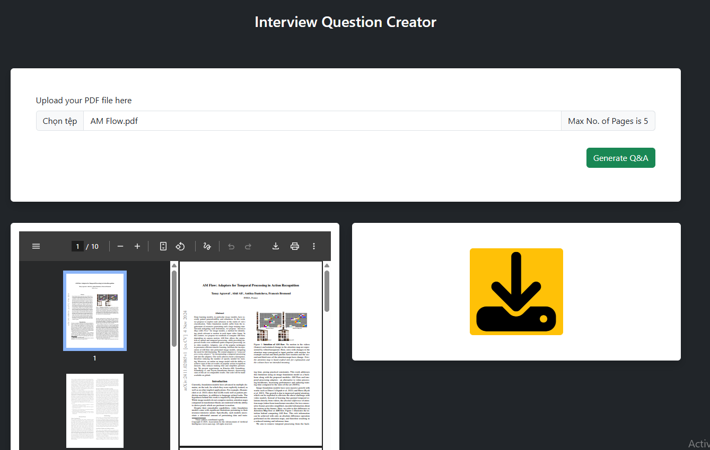
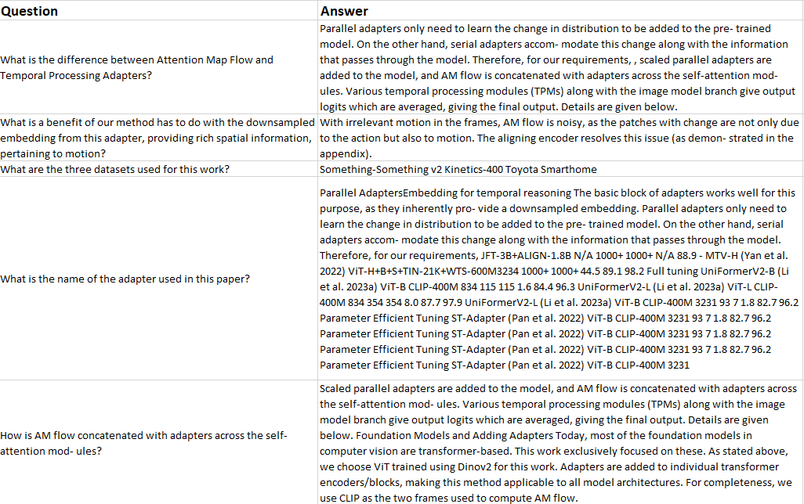

# Doc2Question

Doc2Question is a simple project that automatically generates questions from input documents using AI/NLP techniques.  
It can be used for learning, quizzes, or exam preparation.


## Features
- Input: Text documents (.txt, .pdf, .docx)
- Output: Generated questions
- Easy to extend for different types of documents
- Local AI processing (no API key required in public repo)

## Workflow / How it Works

The Doc2Question project follows these main steps to generate questions and retrieve answers from documents:

1. **Load data**  
   - Input documents are loaded from the `data/` folder (supported formats: `.txt`, `.pdf`, `.docx`).

2. **Chunking**  
   - Documents are split into smaller chunks to make them manageable for the model.  
   - Each chunk preserves context for better question generation.

3. **Question Generation**  
   - Each chunk is combined with a prompt template and passed into the **google/flan-t5-large** model.  
   - The model generates relevant questions from the content of each chunk.

4. **Vector Database Creation**  
   - All chunks are embedded using **sentence-transformers/all-mpnet-base-v2**.  
   - A vector data


## Web Interface Demo
You can use the web interface to upload your documents and get generated questions quickly.  



## Demo Results
Here is an example of the generated questions from a sample document:




## Installation 

Follow these steps to set up Doc2Question locally:

### Requirements 
- Python 3.8 or higher
- Git 
- pip 

### Steps 

1. **Clone the repository:**
```bash
git clone https://github.com/yourusername/Doc2Question.git
cd Doc2Question
```

2. **Create the environment:**
```bash
python -m venv venv
venv\Scripts\activate
```

3. **Run app:**
```bash
python app.py
```

## Key Technologies

This project is built on top of the following main technologies:

- **LangChain** – Framework for building LLM-powered applications  
- **Hugging Face Transformers** – Pre-trained models (google/flan-t5-large) for question generation  
- **Sentence-Transformers** – Embeddings (all-mpnet-base-v2) for semantic search  
- **FAISS / ChromaDB** – Vector databases for storing and retrieving embeddings  
- **FastAPI + Uvicorn** – Web framework and server for the user interface  
- **PyPDF / PyPDF2** – PDF parsing and text extraction  

<p align="center">
  
  
  
  
  
</p>
